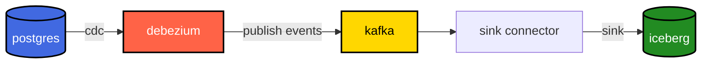
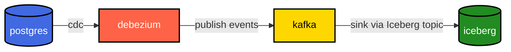

+++
date = '2026-01-18T01:15:26+08:00'
draft = false
title = 'My Dream Data Platform'
+++

After dabbling with data engineering for the past 4 years, this is what my dream data platform looks like:

As you can tell, I'm not a believer of HTAP, and Mooncake has a great blog explaining [why HTAP doesn't work](https://www.mooncake.dev/blog/htap-is-dead).

# OLTP, i.e. just use Postgres

Postgres is my go-to default database. But Postgres alone is not enough, it must have the following features:

1. horizontal scaling
2. database branching
3. database upgrade with zero downtime
4. zero-ETL replication to Iceberg

As of today, there are a few providers that support 1 and 2 such as Supabase and Neon, but 3 and 4 are still missing.

## Zero downtime upgrade

Database upgrade still requires downtime, though you can achieve near-zero downtime by using pgBouncer and logical replication a-la [Instacart](https://www.instacart.com/company/tech-innovation/zero-downtime-postgresql-cutovers), but it's quite hacky with some caveats.

## Zero-ETL replication to Iceberg

This is something I believe will be solved sometime in 2026. My hope is on [pg_mooncake](https://www.mooncake.dev/pgmooncake), which is already on the right track based on their [v0.2 roadmap](https://www.mooncake.dev/blog/pgmooncake-v02discussion), which promises logical replication into Iceberg. However, as of today, their last commit was on 26th October 2025, the same month they announced that they are being [acquired by Databricks](https://www.databricks.com/blog/mooncake-labs-joins-databricks-accelerate-vision-lakebase). Hopefully they will not abandon pg_mooncake, otherwise I have to keep looking for another solution (or maybe build one myself?).

## Candidate: Multigres

I'm looking forward for [Multigres](https://multigres.com/) as the open source solution for this. Multigres specifically has a primitive called [Materializer](https://multigres.com/docs#materializer) that seems to be the foundation on top of which we can build a zero-ETL to Iceberg (which is [confirmed by Sugu himself](https://github.com/multigres/multigres/discussions/218)). The same primitive laso allows them to provide [zero-downtime database upgrade natively](https://multigres.com/docs#migrate-across-postgres-versions).

## Database schema management

This is something that I've not seen provided out of the box by Postgres providers, so I'm happy to tackle it separately. Database schema management is important because there are certain schema changes that can cause database replication to fail (e.g. renaming columns, dropping columns). So it's important to be able to police what kind of changes are allowed.

With [database branching](https://neon.com/docs/introduction/branching), we can take this further: everything someone opens a PR to change a schema, do the following:

1. Pass schema change through policy check to gatekeep schema changes (e.g. no column drop).
2. Create a branch of staging (or even production) database.
3. Apply the schema change on top of the branch.
4. If succes, run some validations to see if anything funny happened (e.g. check for data loss).

In my opinion, [Atlas](https://atlasgo.io/) is currently the best at this. I wouldn't be surprised if it gets acquired by Supabase/Neon/PlanetScale this year.

# Interlude: Where is Kafka?

Kafka has been the go-to solution for realtime data replication from OLTP to OLAP for the past decade. The modern stack looks like this:

While it may look deceivingly simple, it is an operational nightmare at scale:

- Upgrading database requires careful coordination with downstream consumers
- Debezium is known to randomly get into bad state for no reason
- You need to be able to police the kind of schema changes that are applied to the source database, as backward-incompatible changes like renaming column will disrupt the replication
- Source and sink connectors are microservices that can fail

Starting from 2024, there has been a lot of momentum around [Diskless Kafka](https://aiven.io/blog/guide-diskless-apache-kafka-kip-1150) (Warpstream, AutoMQ, Aiven), which promises to eliminate the need of a sink:

However, it still doesn't solve the problems on the source side.

And if you think about it, do you _really_ need Kafka? Kafka is built for low-latency event processing architecture, i.e. <10ms end-to-end latency (or even lower). I believe 95% use cases out there don't actually need this, and is fine with end-to-end latency in the order of seconds.

I think for most use cases, if we can skip Kafka altogether and write from Postgres directly to Iceberg, it's good enough. This is why I think I can live without Kafka.

# OLAP

## Iceberg-first

Iceberg has pretty much won the table format war in 2025, as evident from the increase of support from big companies. Even Databricks, the creator of Delta Lake, has [openly supported Iceberg](https://www.databricks.com/blog/announcing-full-apache-iceberg-support-databricks). So it's no brainer that data should land first into Iceberg.

Using Iceberg requires 2 things:
- Iceberg catalog: [Lakekeeper](https://lakekeeper.io), [Polaris](https://polaris.apache.org/)
- Iceberg operational stack (which includes things like maintenance, observability, governance): [Nimtable](https://www.nimtable.com/), [Amoro](https://amoro.apache.org/)

### Why not pick a favourite data warehouse and sink to it instead?

For few reasons:

- Cloud data warehouse storage cost is super expensive. Be prepared to pay $20-50 per TB/month.
- No data warehouse is a swiss-army knife. Each one is good at certain things. If you end up with a use case that your current data warehouse is not good at, you now have to replicate your data to another data warehouse.
- Avoid vendor lock-in

## Iceberg-native platforms

Once we have Iceberg in-place, everything else can just query Iceberg.

### Composable data warehouses

Instead of being stuck with a single data warehouse, you can now choose whichever data warehouse that fits your use case:

- Need enterprise-scale data warehouse? Use Snowflake or Databricks.
- Need near-realtime customer-facing analytics? Use Clickhouse or Starrocks.
- Need Postgres-compatibility? Use postgres with [pg_lake](https://github.com/Snowflake-Labs/pg_lake).

### Iceberg-native product analytics

This does not exist yet, but I believe someday it will be here as the Iceberg ecosystem matures.

As of today, we have something close to this, which is warehouse-native product analytics: instead of piping your analytics data into a 3rd party product analytics platform, why not have them query your data warehouse instead? Few examples are [Statsig](https://www.statsig.com/), [Mitzu](https://www.mitzu.io/), and [Amplitude](https://amplitude.com/docs/data/warehouse-native/overview).

### Iceberg-native observability stack

I'm not sure if this is here yet, but I believe there is no reason not to leverage Iceberg as the storage layer of observability stack. In fact, [Datadog actually already uses Iceberg](https://datadogon.datadoghq.com/episodes/datadog-on-apache-iceberg/) as their storage layer.

Embracing Iceberg should provide several benefits:

- Your telemetry data is no longer vendor locked-in
- Longer data retention at much lower cost
- Higher cardinality at much lower cost
- Bridge the gap with product analytics

# But all of this seems overkill!

Obviously, if you are a small startup, you don't need all of this. Just start with your favourite Postgres provider.

At some point, your data grows to a point where analytics use cases can no longer work by just querying your source Postgres database directly (especially if you have a bunch of microservices, each with its own database). When this happens, adopt your favourite data warehouse, then setup data replication from postgres to the data warehouse.

At some point, your data grows into hundreds of TBs, at which point the cost of storage alone will make your cry. When this happens, adopt Iceberg, and flip the data ingestion such that it ingests into Iceberg first, and have your data warehouse query Iceberg instead.

Or if you're lazy and just want a managed data platform that provides all of this, just go with Snowflake, Databricks, or Clickhouse, all of which already provides managed Postgres (though [Clickhouse Postgres is still in private preview](https://clickhouse.com/cloud/postgres)). At somepoint I believe one of them will converge closer to my dream data platform.